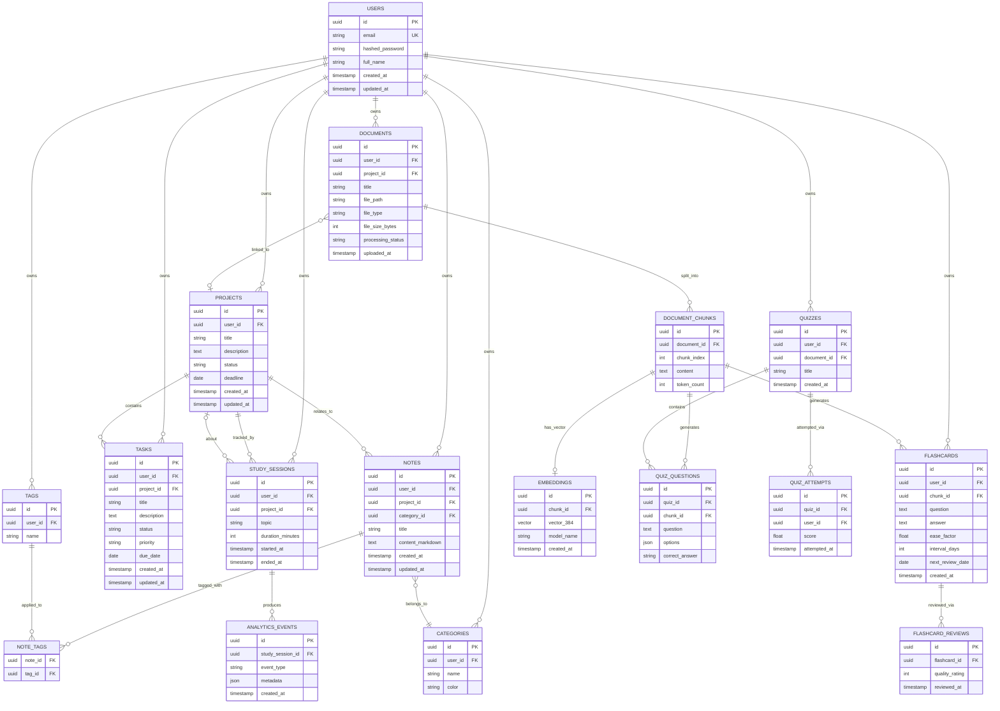

# Entity-Relationship Diagram - Phase 0

Designed for long-term growth: every domain table is owned by a `user` (multi-tenant
ready per ADR-006), uses UUID primary keys (no sequential ID leakage, safe for future
distributed/multi-service scenarios), and uses junction tables for all many-to-many
relationships instead of array columns (keeps it relational and indexable).

---

## Mermaid ER Diagram

---

## Design Notes

### Primary Keys
All tables use `UUID` primary keys instead of auto-incrementing integers. This avoids
leaking record counts through the API, makes IDs safe to generate client-side or in
background workers before insert, and avoids collisions if you ever shard or sync data
across services.

### Multi-tenancy
Every top-level domain table (`projects`, `tasks`, `notes`, `documents`, `flashcards`,
`quizzes`, `study_sessions`, `tags`, `categories`) has a `user_id` foreign key, even
though you are currently the only user. Per ADR-006, this avoids a schema rewrite if
the platform ever supports multiple users.

### Many-to-many via junction tables
`NOTE_TAGS` is a junction table rather than an array column on `notes`. This keeps tag
queries indexable (`WHERE tag_id = ?`) and avoids the well-known pitfalls of array
columns in PostgreSQL (no foreign key integrity, awkward joins).

### Document pipeline normalization
`DOCUMENTS → DOCUMENT_CHUNKS → EMBEDDINGS` mirrors the AI Pipeline in ARCHITECTURE.md
exactly (PDF Upload → Text Extraction → Chunking → Embedding → Vector DB). Each chunk
is a row, not a blob, so flashcards and quiz questions can reference the exact chunk
they were generated from - this gives you citation support for free in Phase 6 (RAG).

### Embeddings table vs. FAISS
The `embeddings` table stores metadata (`model_name`, `created_at`, FK to chunk) in
PostgreSQL even though the actual vector lives in FAISS/Qdrant. This lets you track
which embedding model generated which vector - important when you upgrade models later
(ADR-005) and need to know which chunks still need re-embedding.

### Spaced repetition fields
`flashcards.ease_factor` and `interval_days` implement the SM-2 algorithm fields
directly on the table rather than a separate scheduling table, since one flashcard has
exactly one active schedule state at a time. `flashcard_reviews` is the append-only
history used to recompute those fields after each review.

### Indexing strategy (apply in migrations)
- `notes(user_id, project_id)`, `notes(category_id)` - composite index for dashboard
  queries filtered by project.
- `tasks(user_id, status, due_date)` - covers the common "my pending tasks sorted by
  due date" query.
- `document_chunks(document_id, chunk_index)` - unique composite, preserves chunk order.
- `flashcards(user_id, next_review_date)` - directly supports the daily review query
  from Phase 8.
- `study_sessions(user_id, started_at)` - supports analytics time-range queries.

### What's intentionally deferred
- **Knowledge Graph tables** (concepts, relationships) are not modeled yet - Phase 9 is
  4+ months out and graph schema decisions are easier to make once you've seen real
  note/document data.
- **Experiment Tracker tables** (datasets, models, metrics) are deferred similarly to
  Phase 11.
These are left out deliberately rather than guessed at now, per the project's own rule:
"never place database queries inside API routes" / avoid premature schema commitments
that don't reflect real usage yet.
